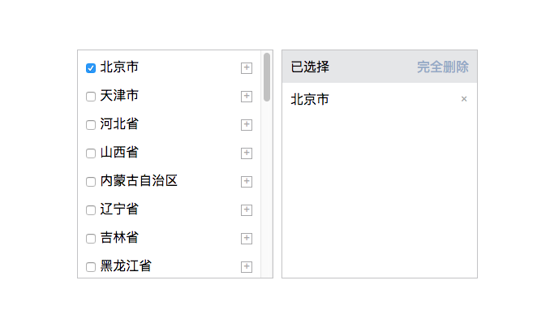

# 简单,美观,方便的 VUE 地域选择插件


## 安装

```base
npm install v-area-selecter --save
```

## 注册为全局组件

```base
import VAreaSelecter from 'v-area-selecter'

Vue.component('v-areaSelecter', VAreaSelecter)

```
## 注册页面组件

```base
import VAreaSelecter from 'v-area-selecter'

export default {
  components: { VAreaSelecter }
}
```

## 效果
 

